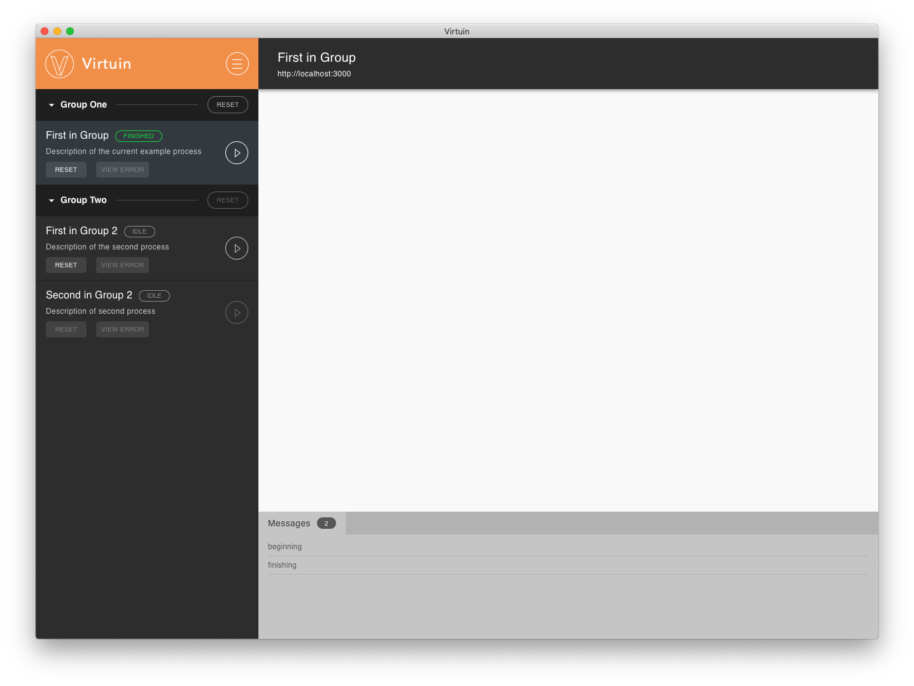

### Virtuin

This is a monorepo containing all the source of Virtuin.

Virtuin is a cross platform application that allows an operator to load, update,
run, stop, and monitor programs in an easy to use graphical interface.
It is useful for areas such as production, testing, and research. Under the hood
Virtuin uses Docker, Docker Compose, and a simple REST API to accomplish this.
Virtuin is language and platform agnostic. You can use whatever languages, platforms,
 and tools you like as long as they are supported by docker.


In a nutshell, a developer will provide a docker compose file, a list of *Tasks* to be executed,
and data for the tasks embedded in a **collection.yml** file recognized by Virtuin. 

*Tasks* are program executables in a docker service, ready to be run with specified arguments and environment variables.

Virtuin will
 - ensure the appropriate docker services are up to date and running.
 - display the list of tasks and information for an operator to utilize.
 - execute the appropriate program in the correct docker service, when a *Task* is run by an operator.
 - ensure task has all necessary data and variables described in the collection.yml
 - display progress, status, messgages, and prompts from a running *Task*
 - bring the docker environment down when the collection.yml is unloaded or
 the GUI is closed.

Virtuin provides a simple rest service so *Tasks* can
display messages, prompts, and progress in the GUI. The rest server runs inside of
 the GUI. The GUI is not bound to just one collection. It can run any Virtuin collection
 and load and unload them as necessary.

Please see
[Virtuin Documentation](docs/documentation.md)



This repo contains 2 applications
- GUI *packages/virtuingui2* - use by operator or developer
- CLI *packages/cli* - can be used by developer to help build application or test

Libraries used by the applications
- Task Dispatcher *packages/virtuintaskdispatcher* - controls docker environment and maintains state of all tasks
- Rest Service *packages/task-rest-service* - rest api where running tasks can update progress and display messages and prompts.


<p id="prebuilt-packages"></p>

## Prebuilt packages

Prebuilt packages and installers can be found at ***https://release.cpsamtec.now.sh***

### Docker
Prebuilt packages can be found in the docker image **cpsamtec/virtuin-gui:latest**.
It contains packaged applications and installers for Mac, Linux, and Windows.

- Get and run docker image ```docker run  --name gui-builder -dit cpsamtec/virtuin-gui:latest bash```
- List available installers and packaged applications ```docker exec -it gui-builder ls /project/release```
- Copy the desired application or installer to your computer ```docker cp gui-builder:/project/release/[Desired Item] /tmp/```


<p id="build"></p>

## Build and package yourself

### Docker
View the *Dockerfile* in the repo to create your own packaged applications and
 installers for Mac, Linux, and Windows from a docker container. This can be done
 from any system with Docker installed.

### To build and package directly on Mac or Linux

It is not possible to directly build the GUI directly on Windows at this moment in time.
There is some issue with webpack and babel. On a Mac or Linux machine

##### Install
- node 10.15+
  [download node](https://nodejs.org/en/download/)
- yarn
  ```npm install -g yarn```


#### Build

1. first clone the repo and cd into it
2. ```yarn install```
3. ```yarn run bootstrap ```
4. ```yarn run build ```


#### Run

 ```yarn run run:gui```

<p id="package"></p>

#### Package

Make sure you have completed *Build* steps first. To package and create an installable executable

``` yarn run package ```

This will create an installer for the GUI. It can run on the same system it was
packaged under (Windows, Mac, Linux).
