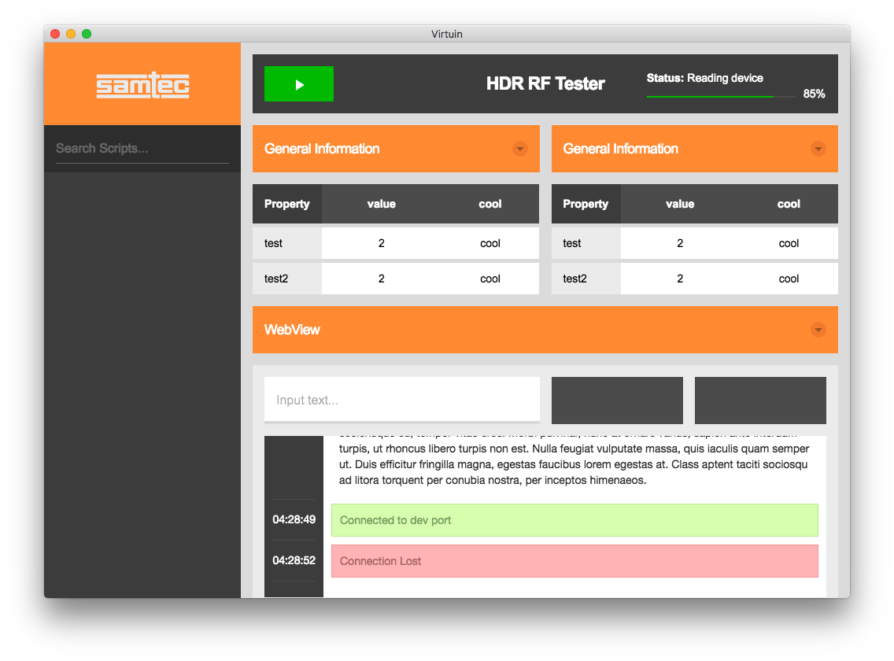

# Virtuin

### Entry point for controlling and monitoring Virtuin-based tests within Samtec.

[![Build Status][travis-image]][travis-url]
[![Appveyor Build Status][appveyor-image]][appveyor-url]
[![Dependency Status][david_img]][david_site]
[![Github Tag][github-tag-image]][github-tag-url]

## Screenshot


## Install

* **Note: requires a node version >= 6 and an npm version >= 3.**
* **If you have installation or compilation issues with this project, please see [our debugging guide](https://github.com/chentsulin/electron-react-boilerplate/issues/400)**

First, clone the repo via git:

```bash
git clone git@bitbucket.org:samteccmd/virtuincore.git your-project-name
```

And then install dependencies.

```bash
$ cd your-project-name && yarn install
```

## Run

Start the app in the `dev` environment. This starts the renderer process in [**hot-module-replacement**](https://webpack.js.org/guides/hmr-react/) mode and starts a server sends hot updates to the renderer process:

```bash
$ yarn run dev
```

You Run these two commands __simultaneously__ in different console tabs:

```bash
$ yarn run hot-updates-server
$ yarn run start-hot-renderer
```

## Editor Configuration
**Atom**
```bash
apm install editorconfig es6-javascript atom-ternjs javascript-snippets linter linter-eslint language-babel autocomplete-modules file-icons
```

## DevTools

#### Toggle Chrome DevTools

- OS X: <kbd>Cmd</kbd> <kbd>Alt</kbd> <kbd>I</kbd> or <kbd>F12</kbd>
- Linux: <kbd>Ctrl</kbd> <kbd>Shift</kbd> <kbd>I</kbd> or <kbd>F12</kbd>
- Windows: <kbd>Ctrl</kbd> <kbd>Shift</kbd> <kbd>I</kbd> or <kbd>F12</kbd> 😭💩🔥

*See [electron-debug](https://github.com/sindresorhus/electron-debug) for more information.*

#### DevTools extension

* [Devtron](https://github.com/electron/devtron) - Install via [electron-debug](https://github.com/sindresorhus/electron-debug).
* [React Developer Tools](https://github.com/facebook/react-devtools) - Install via [electron-devtools-installer](https://github.com/GPMDP/electron-devtools-installer).
* [Redux DevTools](https://github.com/zalmoxisus/redux-devtools-extension) - Install via [electron-devtools-installer](https://github.com/GPMDP/electron-devtools-installer).

You can find the tabs on Chrome DevTools.

If you want to update extensions version, please set `UPGRADE_EXTENSIONS` env, just run:

```bash
$ UPGRADE_EXTENSIONS=1 yarn run dev

# For Windows
$ set UPGRADE_EXTENSIONS=1 && yarn run dev
```

:bulb: You can debug your production build with devtools by simply setting the `DEBUG_PROD` env variable:
```
DEBUG_PROD=true yarn run package
```

## CSS Modules

This boilerplate out of the box is configured to use [css-modules](https://github.com/css-modules/css-modules).

All `.css` file extensions will use css-modules unless it has `.global.css`.

If you need global styles, stylesheets with `.global.css` will not go through the
css-modules loader. e.g. `app.global.css`

If you want to import global css libraries (like `bootstrap`), you can just write the following code in `.global.css`:

```css
@import "~bootstrap/dist/css/bootstrap.css";
```

## Sass support

If you want to use Sass in your app, you only need to import `.sass` files instead of `.css` once:
```js
import './app.global.scss';
```

## Packaging

To package apps for the local platform:

```bash
$ yarn run package
```

To package apps for all platforms:

First, refer to [Multi Platform Build](https://github.com/electron-userland/electron-builder/wiki/Multi-Platform-Build) for dependencies.

Then,
```bash
$ yarn run package-all
```

To package apps with options:

```bash
$ yarn run package -- --[option]
```

## Further commands

To run the application without packaging run

```bash
$ yarn run build
$ yarn start
```

To run End-to-End Test

```bash
$ yarn run build
$ yarn run test-e2e
```

#### Options

See [electron-builder CLI Usage](https://github.com/electron-userland/electron-builder#cli-usage)

#### Module Structure

This project uses a [two package.json structure](https://github.com/electron-userland/electron-builder/wiki/Two-package.json-Structure).

1. If the module is native to a platform or otherwise should be included with the published package (i.e. bcrypt, openbci), it should be listed under `dependencies` in `./app/package.json`.
2. If a module is `import`ed by another module, include it in `dependencies` in `./package.json`.   See [this ESLint rule](https://github.com/benmosher/eslint-plugin-import/blob/master/docs/rules/no-extraneous-dependencies.md).
3. Otherwise, modules used for building, testing and debugging should be included in `devDependencies` in `./package.json`.

## Static Type Checking
This project uses Flow-Type support! You can annotate your code with types, [get Flow errors as ESLint errors](https://github.com/amilajack/eslint-plugin-flowtype-errors), and get [type errors during runtime](https://github.com/codemix/flow-runtime) during development. Types are completely optional but desired.


## Contributing

Please read [CONTRIBUTING.md](CONTRIBUTING.md) for details on our code of conduct, and the process for submitting pull requests to us.

## Versioning

We use [SemVer](http://semver.org/) for versioning. For the versions available, see the [tags on this repository](https://bitbucket.org/samteccmd/samtecdeviceconnect/commits/).

## Maintainers

- [Adam Page](adam.page@samtec.com)
- [Chris Page](chris.page@samtec.com)
- [Nathan Page](nathan.page@samtec.com)

## License

This project is licensed under the MIT License - see the [LICENSE.md](LICENSE.md) file for details

[](https://facebook.github.io/react/)
[](https://webpack.github.io/)
[](http://redux.js.org/)
[](https://github.com/ReactTraining/react-router)
[](https://flowtype.org/)
[](http://eslint.org/)
[](https://facebook.github.io/jest/)
[](https://yarnpkg.com/)

[Electron](http://electron.atom.io/) application based on [React](https://facebook.github.io/react/), [Redux](https://github.com/reactjs/redux), [React Router](https://github.com/reactjs/react-router), [Webpack](http://webpack.github.io/docs/), [React Transform HMR](https://github.com/gaearon/react-transform-hmr) for rapid application development.


[npm-image]: https://img.shields.io/npm/v/electron-react-boilerplate.svg?style=flat-square
[github-tag-image]: https://img.shields.io/github/tag/chentsulin/electron-react-boilerplate.svg
[github-tag-url]: https://github.com/chentsulin/electron-react-boilerplate/releases/latest
[travis-image]: https://travis-ci.org/chentsulin/electron-react-boilerplate.svg?branch=master
[travis-url]: https://travis-ci.org/chentsulin/electron-react-boilerplate
[appveyor-image]: https://ci.appveyor.com/api/projects/status/github/chentsulin/electron-react-boilerplate?svg=true
[appveyor-url]: https://ci.appveyor.com/project/chentsulin/electron-react-boilerplate/branch/master
[david_img]: https://img.shields.io/david/chentsulin/electron-react-boilerplate.svg
[david_site]: https://david-dm.org/chentsulin/electron-react-boilerplate
