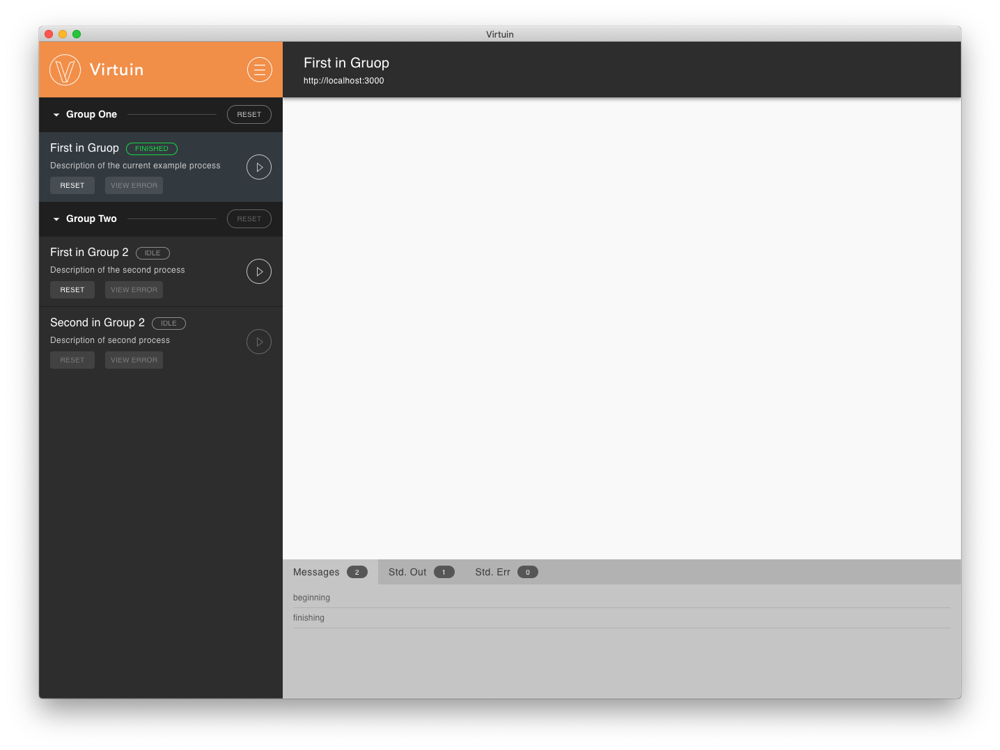

# Virtuin GUI

An interface to be used by an operator to run programs or *Tasks* and get feedback.
When the collection is in *development* mode extra views will become visible such
as program/task stdout and stderr.

The GUI displays

- Groups of *Tasks* to run
- Progress of Task
- Status of Task
- Alerts
- Prompts
- Web view to custom webpage
- Names
- Descriptions
- Messages
- Run and reset *Task* button

### Development interface

### Release interface

#### Key menu bar items

- Collection
  * Load Collection File
  * Load Collection URL
  * Reload Collection
  * Down Collection

- Developer: Only visible when collection in *development* mode
  * Bash in service - When a collection is loaded this will present instructions
  of how to attach to the service of a task in a bash environment. Under the
  hood Virtuin stores and launchers the docker compose in the folder
  /APP_DATA/Virtuin/COLLECTION_NAME.  
